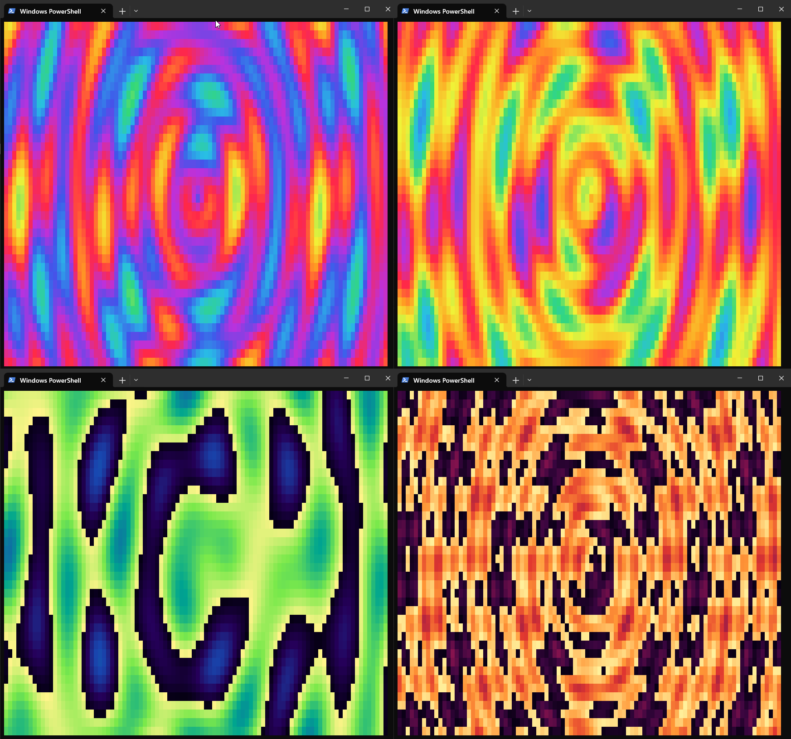

**PlasmaTerm** is a lightweight real-time generative plasma visualizer with a minimal, keyboard-driven interface. The rendered viewport acts as the primary interaction surface, avoiding conventional menus and persistent UI.

Animated plasma patterns are controlled through a compact set of parameters for spatial frequency, hue range, animation speed, and hue shifting. Keyboard controls allow immediate visual exploration, including saving and recalling configurations.
Unlike Perlin or Simplex noise, the apparent complexity does not come from pseudo-randomness; it emerges deterministically from the interaction of simple mathematical waves.

PlasmaTerm is designed to remain small, extensible and immediate while providing a foundation for richer direct control and generative visual experimentation.
The ability to edit the config file live, is intended to enable external scripts to easily change the visualisation. This could be used for notifications, status representation, sunrise/set clock or any other whimsical use case that would benefit from pretty flowing patterns.

Controls:

| Key       | Action                                       |
| ---------- | -------------------------------------------- |
| `0–9`      | Immediately load preset                      |
| `Alt+S`    | Save to last-loaded preset; slot 0 initially |
| `Ctrl+0–9` | Immediately load corresponding LUT           |
| `Q/A`      | Increase/decrease frequency Y                |
| `W/S`      | Increase/decrease frequency X                |
| `E/D`      | Increase/decrease hue start                  |
| `R/F`      | Increase/decrease hue end                    |
| `T/G`      | Increase/decrease speed                      |
| `Y/H`      | Increase/decrease hue shift                  |
| `U/J`      | Increase/decrease radius                     |
| `I/K`      | Increase/decrease palette size               |
| `O/L`      | Increase/decrease FPS                        |

Modifiers:

* No modifier: fine adjustment
* `Shift`: 10× step
* `Ctrl`: 100× step
* Holding an adjustment key repeats it

Parameter changes update the "live" config immediately, and external edits to the config file should be applied instantly upon saving.

